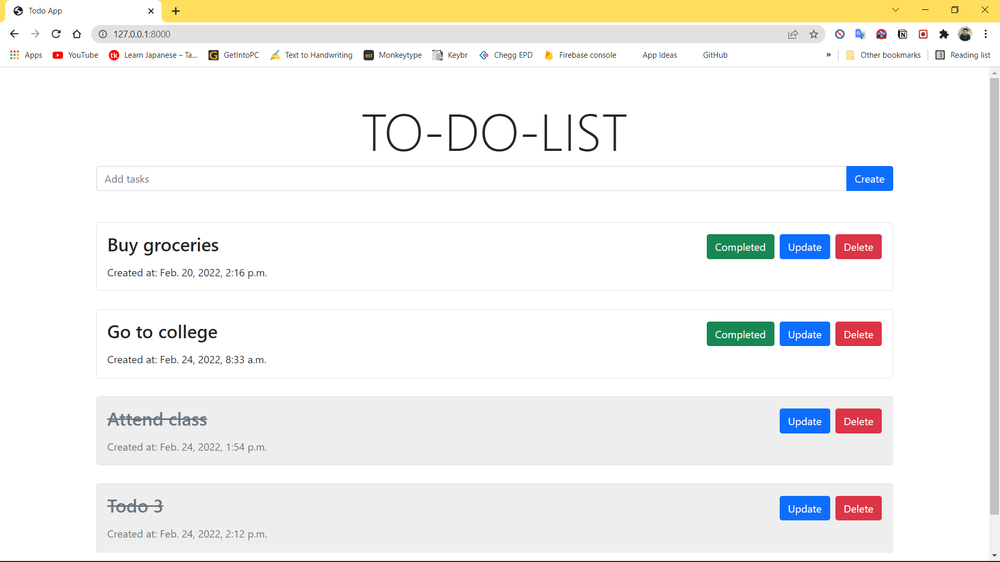
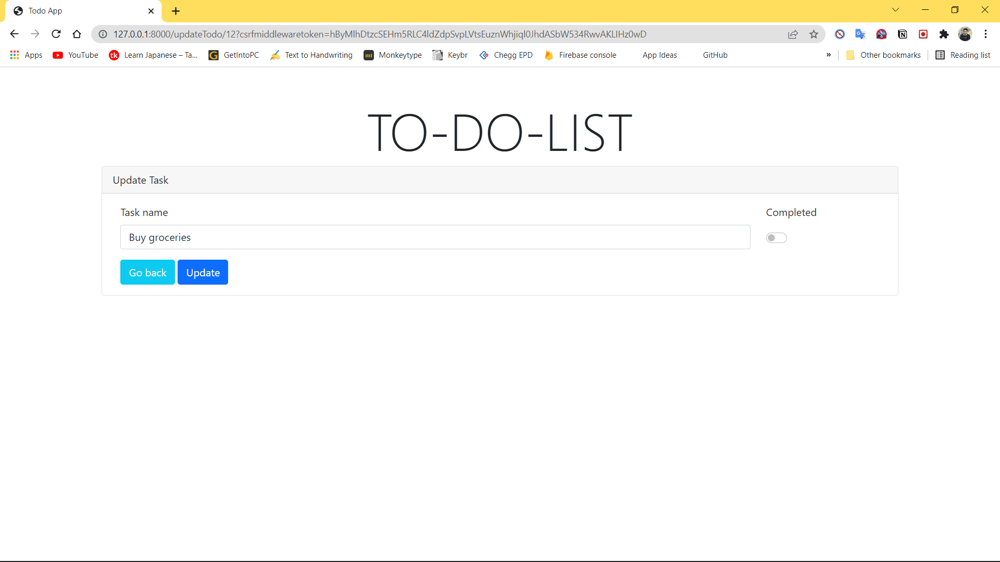
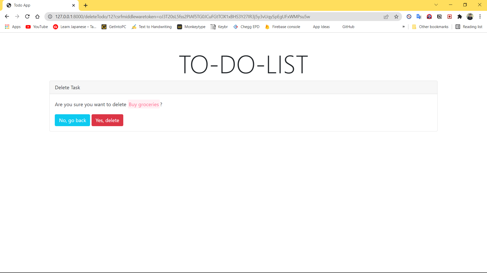

<!-- PROJECT LOGO -->
 

  <h3 align="start">Todo</h3>

  

    A simple Todo Website using Bootstrap and Django.
  

<!-- ABOUT THE PROJECT -->
## About The Project

  This is a basic todo website where users can create new tasks, complete it, update it and delete it. <b>Boorstrap</b> is used for designing the website and <b>Django</b> is used for the backend.

                                                                               
### Built With

* [Bootstrap](https://getbootstrap.com/)
* [Django](https://www.djangoproject.com/)

